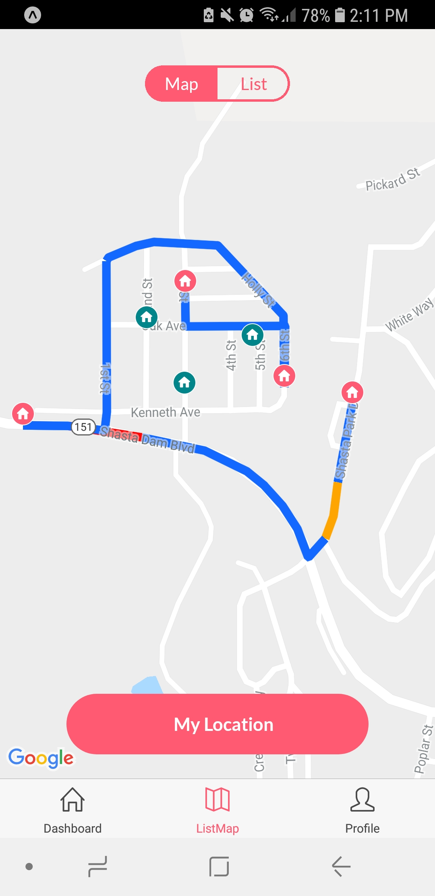
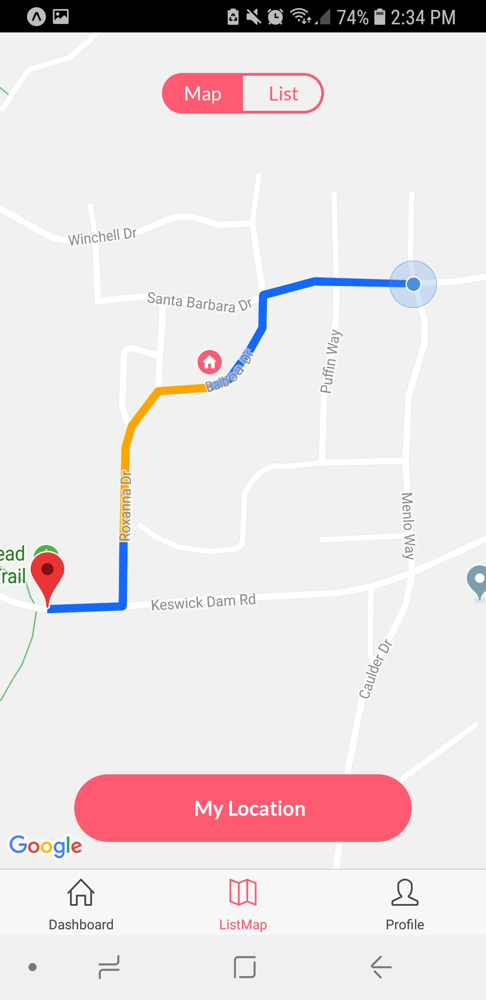

# Evachain

## Prerequisites
Ensure that you have `node` and `npm` installed.

## Installation
```
npm install -g exp
npm install
exp start
```
## For Mac 

```
brew install watchman

```

<p align="center">
<a href="https://youtu.be/6HrcKqWbwoY">Project Video</a> | 
</p>

## Overview

- [Description](#description)
- [Features](#features)
    - [Student Features](#student-features)
    - [Educator Features](#educator-features)
    - [App Features](#app-features)
- [Changelog](#changelog)
- [Future Plans](#future-plans)


## Description

Edulytics is a Web Application targeted at 2 main stakeholders, Students and Educators, aiming to enhance both learning and teaching capabilities.

## Technology Stack

Edulytics is built on React with Redux, retrieving data from Firebase which is dynamically updated using a Jupyter Notebook. Within the notebook, weekly downloads are made from Amazon's S3 Buckets together with real-time API calls for more time-sensitive data.

## Features
### Student Features

#### 1) Onboarding
<p align="center"></p>
- Explain how people use it
- file directory in src

#### 2) Dashboard
<p align="center"></p>

The left column of the second row contains the Attribute chart with 6 Attributes: Hardwork, Dedication, Mastery, Proactive, Effort and Diligence. The following table show how each metric is calculated.

<div align="center">
	<table>
		<tr>
			<th>Metric</th>
			<th>Calculation</th>
		</tr>
		<tr>
			<td>Hardwork</td>
			<td>No. of Assignments Submitted</td>
		</tr>
		<tr>
			<td>Mastery</td>
			<td>Average Time Taken per CodeCombat Level</td>
		</tr>
		<tr>
			<td>Proactiveness</td>
			<td>Relative Time Taken for Assignment Submissions</td>
		</tr>
		<tr>
			<td>Effort</td>
			<td>Relative Total Playtime</td>
		</tr>
		<tr>
			<td>Diligence</td>
			<td>Completion and Time Taken for Video Assignments</td>
		</tr>
	</table>
</div>

#### 3) Map View
##### Fireman view
<p align="center"></p>
During an emergency, for the fireman, what will be shown on this screen are the locations of the houses in the area that he is in charge of and their statuses. By status we refer to whether a family has notified through the app of their safety status, and if they have done so, whether they need assistance to evacuate or they are able to evacuate on their own. Based on their status, our app will also be able to plan out the most efficient route that the fireman can take, by prioritizing the houses that require assistance and those who have yet to respond, thus best utilizing the fireman's time. This route will also be shown in this view. 

<p align="center"></p>
##### Volunteer view
Volunteers will also be shown a similar view with nearby houses and their statuses, and for them a route will be planned based on who they can help along the way to the shelter and shown to them in this page.

<p align="center"></p>
##### Civilian view
For regular civilians who have signed up as non-volunteers, just a route showing the best path to the nearest shelter that can accomodate them will be shown and the users can use that to navigate to the shelter. If firemen need to block out a particular road to have better access to any particular area, they could also reflect the changes on the civilians map so that users of the app know that they have to avoid a particular road.

#### 4) Push Notifications
<p align="center"></p>

To the right of the row contains Elo Distribution Chart, which enables students to see their standings among their peers. Students will also be able to see the distribution and frequency of other students at each Elo level. In doing so, Edulytics aim to aid students in setting smart goals accordingly.


## Changelog
 - Weak Student Monitoring Dashboard
 - Exception Handling for Invalid/Missing Data

## Future Plans
 - User Authentication
 - Inclusion of more User Types (Cohort Administrator)
 - Predictive Analytics
 - Mobile-Friendlier Layout
 - UI Refresh

