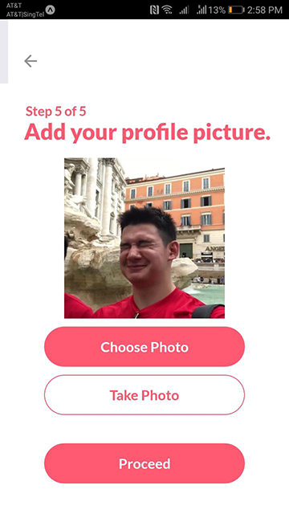

# Evachain

## Prerequisites
Ensure that you have `node` and `npm` installed, to compile and run our React Native project.

### Mac
```
brew update
brew install node
```
###Windows

You can download the latest NodeJS from [here](https://nodejs.org/en/)
## Installation

###Install from source

Clone our repo
```
git clone https://github.com/muruges95/Evachain.git
```
Install expo
```
npm install expo-cli --global

```

To run our project
```
npm install -g exp
npm install
exp start
```
#### For Mac 

```
brew install watchman

```

###Install from platform installer (.apk or .ipa)
####.apk
1. Download [Evachain.apk](Evachain.apk) onto your phone.
2. Enable installation from 'unknown sources'
3. Install the apk and run!


####.ipa

Follow [this guide](https://mobikul.com/install-ipa-file-iphone-device/) to install the .ipa on your iPhone

###Quick Start
For a quick start, check out [our demo video](https://youtu.be/6HrcKqWbwoY)!

## Overview

- [Description](#description)
- [Features](#features)
    - [Student Features](#student-features)
    - [Educator Features](#educator-features)
    - [App Features](#app-features)
- [Changelog](#changelog)
- [Future Plans](#future-plans)


## Description

Evachain is an mobile application that facilitates the evacuation process in emergencies.

## Technology Stack

Evachain is built on react-native, retrieving data from IBM Cloudant. It also makes use of external API in the application such as Google Maps, Twilio and Geocode API.

## Features

### 1) Onboarding
Onboarding is the process of signing civilians up for our application. The following data is collected:

<p align="center">


</p>

* Splash screen
* First and Last Name

<p align="center">


</p>

* House address and mobile phone number
* Important household details
    * Do you have pets?
    * Number of family members
    * Do you have mobility issues? (Require assistance in evacuation

<p align="center">


</p>

* Signup screen to be a volunteer
* Adding a profile picture for easier identification

The house addresses will be used to locate the houses in our Google Mapview, 
to be shown on the firemen app. The house addresses of all onboarded civlians will be used for route planning, to find the most efficient route between all houses.

Civilians have the option to sign up to be volunteers, 
indicating their interest in the onboarding process. For now, volunteers have the same screen as firemen, 
as our basic implementation is such that their function is the same.

Onboarding is an important process that helps to streamline the app flow.

### 2) Dashboard

Dashboard is the first screen that civilians see after entering the app. It displays the following important information:
* The emergency status: Safe or Fire nearby
    * What you have verified your status as: Verified, Not Verified, Need assistance
* A Twitter feed of CALFIRE account. The tweets are live and real-time, providing civilians with information of fires.
* Important evacuation information, articles about how-to evacuate, what-to-do in situation of emergencies etc. This will also be in real-time, pulling information from our Cloudant database.

<p align="center">

</p>

### 3) Map View
#### Fireman view

<p align="center"></p>

##### Fireman view
During an emergency, for the fireman, what will be shown on this screen are the locations of the houses in the area that he is in charge of and their statuses. By status we refer to whether a family has notified through the app of their safety status, and if they have done so, whether they need assistance to evacuate or they are able to evacuate on their own. Based on their status, our app will also be able to plan out the most efficient route that the fireman can take, by prioritizing the houses that require assistance and those who have yet to respond, thus best utilizing the fireman's time. This route will also be shown in this view. 

<p align="center"></p>

#### Volunteer view
Volunteers will also be shown a similar view with nearby houses and their statuses, and for them a route will be planned based on who they can help along the way to the shelter and shown to them in this page.

<p align="center"></p>

#### Civilian view
For regular civilians who have signed up as non-volunteers, just a route showing the best path to the nearest shelter that can accomodate them will be shown and the users can use that to navigate to the shelter. If firemen need to block out a particular road to have better access to any particular area, they could also reflect the changes on the civilians map so that users of the app know that they have to avoid a particular road.

### 4) Push Notifications

<p align="center">


</p>

An example of an SMS notification & a Push notification

Our application sends push notifications to users in the case of an emergency to warn them and also allow them to 
verify their safety at the same time. For residents living near the disaster zone who do not have our application installed, we will send them a text message to notify them as well. Text messages will be done through the Twilio API.

Tapping on the notification will redirect them to the app, and show them this modal popup in the app on the dashboard

<p align="center">

</p>

## Future Plans
 - User Authentication
 - Inclusion of more User Types (Cohort Administrator)
 - Predictive Analytics
 - Mobile-Friendlier Layout
 - UI Refresh

