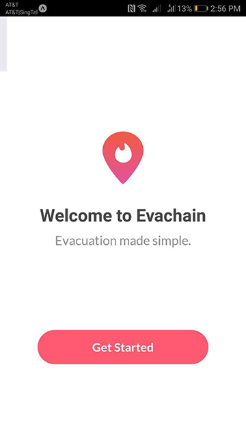

# Evachain

## Prerequisites
Ensure that you have `node` and `npm` installed.

## Installation
```
npm install -g exp
npm install
exp start
```
## For Mac 

```
brew install watchman

```

<p align="center">
<a href="https://youtu.be/6HrcKqWbwoY">Project Video</a> | 
</p>

## Overview

- [Description](#description)
- [Features](#features)
    - [Student Features](#student-features)
    - [Educator Features](#educator-features)
    - [App Features](#app-features)
- [Changelog](#changelog)
- [Future Plans](#future-plans)


## Description

Evachain is an mobile application that facilitates the evacuation process in emergencies.

## Technology Stack

Evachain is built on react-native, retrieving data from IBM Cloudant. It also makes use of external API in the application such as Google Maps, Twilio and Geocode API.

## Features

#### 1) Onboarding
Onboarding is the process of signing civilians up for our application. The following data is collected:


* First and Last Name

* House address and mobile phone number


* Important household details
    * Do you have pets?
    * Number of family members
    * Do you have mobility issues? (Require assistance in evacuation

* Signup screen to be a volunteer

* Adding a profile picture for easier identification

The house addresses will be used to locate the houses in our Google Mapview, 
to be shown on the firemen app. The house addresses of all onboarded civlians will be used for route planning, to find the most efficient route between all houses.

Civilians have the option to sign up to be volunteers, 
indicating their interest in the onboarding process. For now, volunteers have the same screen as firemen, 
as our basic implementation is such that their function is the same.

Onboarding is an important process that helps to streamline the app flow.

#### 2) Dashboard
Dashboard is the first screen that civilians see after entering the app. It displays the following important information:
* The emergency status: Safe or Fire nearby
    * What you have verified your status as: Verified, Not Verified, Need assistance
* A Twitter feed of CALFIRE account. The tweets are live and real-time, providing civilians with information of fires.
* Important evacuation information, articles about how-to evacuate, what-to-do in situation of emergencies etc. This will also be in real-time, pulling information from our Cloudant database.


### 3) Map View
<p align="center"></p>

The middle of the row shows contains article recommendations based on the traits of the student. This feature ultilises the Attribute Hexagram to see which areas the student is lacking in, populating the list with appropriate articles based on the attributes. For example, if a student is lacking Dedication and Hardwork attributes, articles related to improving productivity would appear on the list.

### 4) Push Notifications
<p align="left">
<br/>SMS notification</p>


<p align="left">
<br/>Push notification</p>


Our application sends push notifications to users in the case of an emergency to warn them and also allow them to verify their safety at the same time. For residents living near the disaster zone who do not have our application installed, we will send them a text message to notify them as well. Text messages will be done through the Twilio API.


## Changelog
 - Weak Student Monitoring Dashboard
 - Exception Handling for Invalid/Missing Data

## Future Plans
 - User Authentication
 - Inclusion of more User Types (Cohort Administrator)
 - Predictive Analytics
 - Mobile-Friendlier Layout
 - UI Refresh

