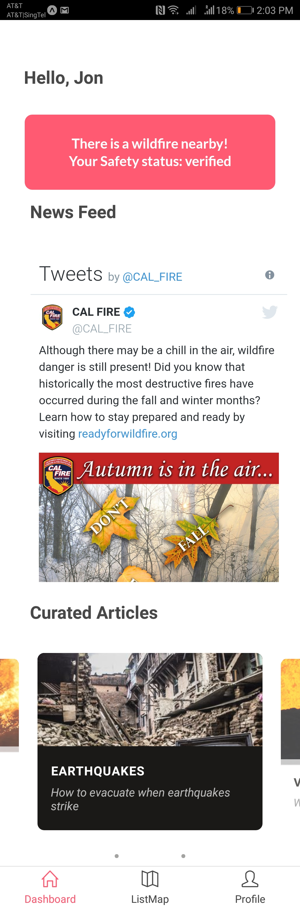

# Evachain

## Prerequisites
Ensure that you have `node` and `npm` installed, to compile and run our React Native project.

### Mac
```
brew update
brew install node
```
### Windows

You can download the latest NodeJS from [here](https://nodejs.org/en/)
## Installation

### Install from source

Clone our repo
```
git clone https://github.com/muruges95/Evachain.git
```
Install expo
```
npm install expo-cli --global

```

To run our project
```
npm install -g exp
npm install
exp start
```
#### For Mac 

```
brew install watchman

```

### Install from platform installer (.apk or .ipa)
#### .apk
1. Download [Evachain.apk](Evachain.apk) onto your phone.
2. Enable installation from 'unknown sources'
3. Install the apk and run!


#### .ipa

For now, as we do not have Apple developer accounts, please use the ```exp start``` method of running the app on your local machine
and iPhone
Follow [this guide](https://mobikul.com/install-ipa-file-iphone-device/) to install the .ipa on your iPhone. 

### Quick overview
Check out [our demo video](https://youtu.be/I49lWyeQgaE) for a quick overview. 

## Overview

- [Description](#description)
- [Features](#features)
- [Future Plans](#future-plans)


## Description

Evachain is a dual-platform mobile application that facilitates the evacuation process in emergencies. The two platforms are meant to be used by civilians and emergency personnel respectively. Data will be shared between both parties to ensure real-time updates. For the sake of the demo, we will be using fire emergencies as the example use case. 
Evachain can be configured for use in other emergencies too.

## Technology Stack

Evachain is built on React-Native, retrieving data from IBM Cloudant. It also makes use of external API in the application such as Google Maps, Twilio and Geocode API.

# Civilian's Platform

## Features

### 1) Area-wide notification for all civilians in red-zone

<p align="center">


</p>

An example of an SMS notification & a Push notification

Our application sends push notifications to users in the case of an emergency to warn them and also allow them to 
verify their safety at the same time. For residents living near the disaster zone who do not have our application installed, we will send them a text message to notify them as well. Text messages will be done through the Twilio API.

Tapping on the notification will redirect them to the app, and show them this modal popup in the app on the dashboard

<p align="center">

</p>

### 2) Shelter allocation based on distance and personal information provided

<p align="center"></p>

#### Civilian view
For regular civilians who have signed up as non-volunteers, just a route showing the best path to the nearest shelter that can accomodate them will be shown and the users can use that to navigate to the shelter. If firemen need to block out a particular road to have better access to any particular area, they could also reflect the changes on the civilians map so that users of the app know that they have to avoid a particular road.

Our user’s personal information can be provided in the pre-emergency onboarding process that collects data like the number of pets/members in a household, mobility and health issues. This data can be integrated with a shelter management dashboard to help managers anticipate resources needed - one of our potential future use cases. 

### 3) Dashboard

Dashboard is the first screen that civilians see after entering the app. It displays the following important information:
* The emergency status: Safe or Fire nearby
    * What you have verified your status as: Verified, Not Verified, Need assistance
* A Twitter feed of CALFIRE account. The tweets are live and real-time, providing civilians with information of fires.
* Important evacuation information, articles about how-to evacuate, what-to-do in situation of emergencies etc. This will also be in real-time, pulling information from our Cloudant database.

<p align="center">

</p>

Evachain listens to a RESTful API database for status of fire(safe or emergency). When the status changes on the 
database, the app will change the fire status. Upon change of status, a push notification will be sent, where users can tap on. In the app on the dashboard, a modal pops up and asks 
civilians for their fire status.

### 4) Auto-updates on Facebook

<p align="center">

</p>

Auto-updates on Facebook to notify friends and family. This allows for lesser missing cases reported and more resources allocated to rescuing victims that are actually in danger. 

### 5) Decentralized evacuation aid

<p align="center"></p>

Civilians can volunteer to aid in evacuation process. If a civilian in need is near the volunteer, they will be allocated to the volunteer and a push notification will be sent to both parties. Directions to the household in need will be provided so that volunteer can help them evacuate quickly. Volunteers will be able to change the safety status of the civilian in need to ensure double-checking does not occur, lightening the load on emergency personnel. 

# Emergency Personnel's platform

### 1) Comprehensive overview of all households

Comprehensive overview of all households with easy color indicators to show safety status (<font color="green">Green</font> = verified & evacuated, <font color="red">Red</font> = In need of assistance, <font color="grey">Grey</font> = unresponsive). Data of all households to be provided in order to accommodate for everyone. 

### 2) Route planning

Route planning with smart algorithm that prioritizes red houses followed by grey houses. Green houses will be avoided. Ability to change status of households that are evacuated to ensure that double-checking does not occur between emergency personnel.


<p align="center"></p>

##### Emergency Personnel view
During an emergency, for the fireman, what will be shown on this screen are the locations of the houses in the area that he is in charge of and their statuses. By status we refer to whether a family has notified through the app of their safety status, and if they have done so, whether they need assistance to evacuate or they are able to evacuate on their own. Based on their status, our app will also be able to plan out the most efficient route that the fireman can take, by prioritizing the houses that require assistance and those who have yet to respond, thus best utilizing the fireman's time. This route will also be shown in this view. 

## Future Plans
### Scaling on IBM Kubernetes Cloud Service
AS our app grows, we plan to scale it up using the Kubernetes Cloud Service. We plan to containerize our application and databases, for easy scaling and automated app deployment.

### Intelligent Route Planning
As more users onboard our app, higher volume of route planning is required and efficiency is the key. We plan to implement [a smarter Google Maps TSP Solver](https://github.com/dashersw/google-maps-tsp-solver) in our app.
